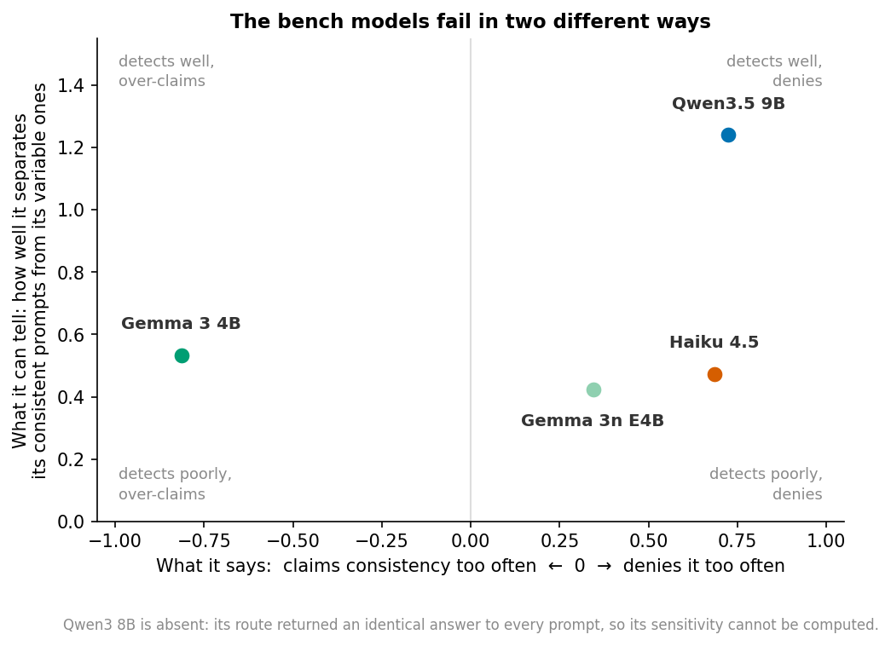
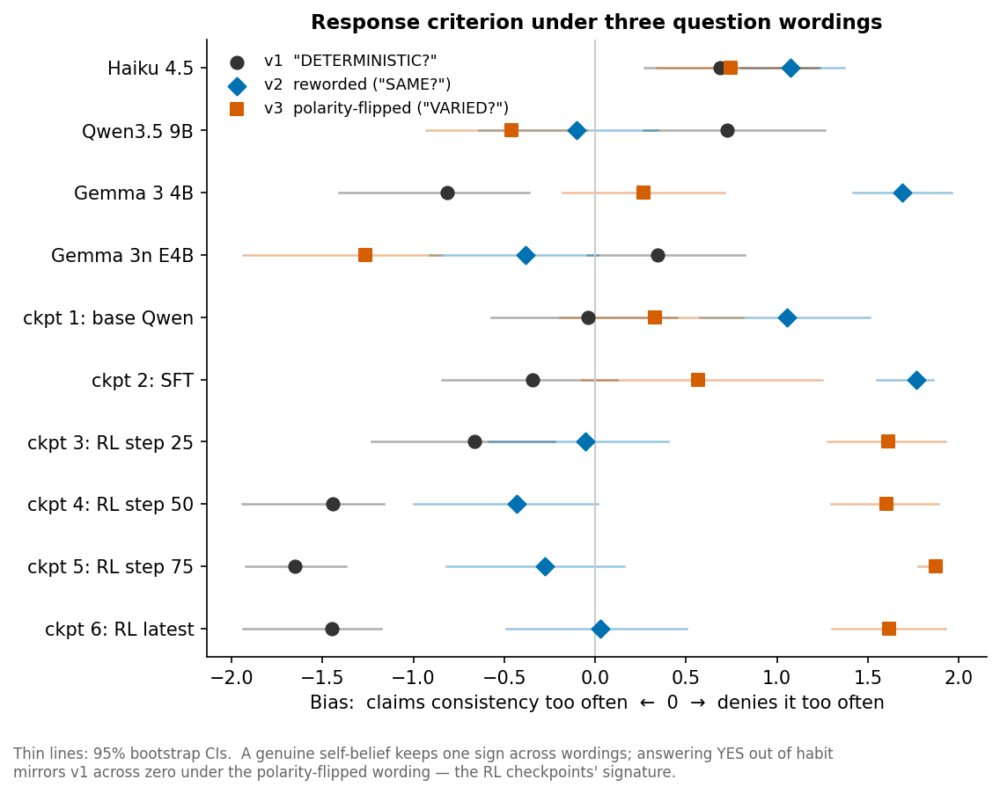
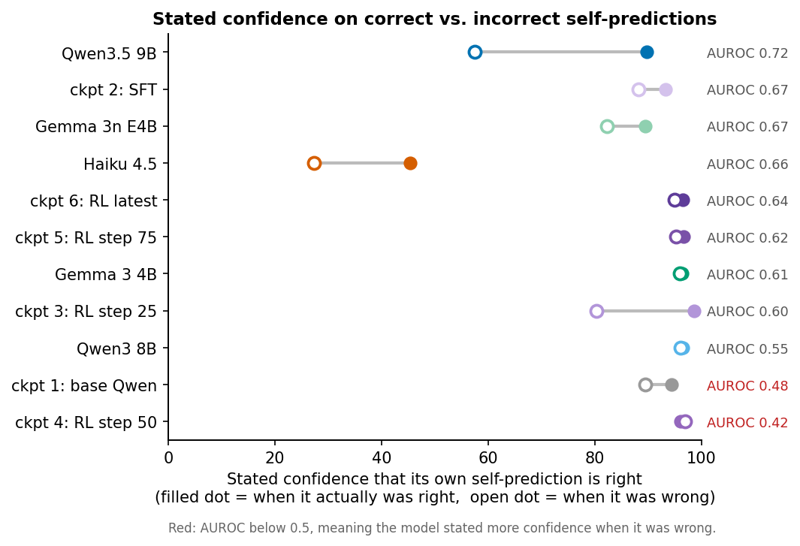
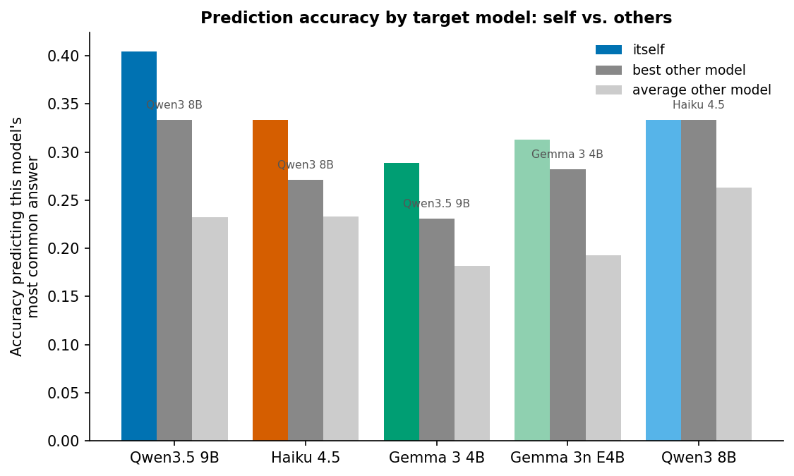
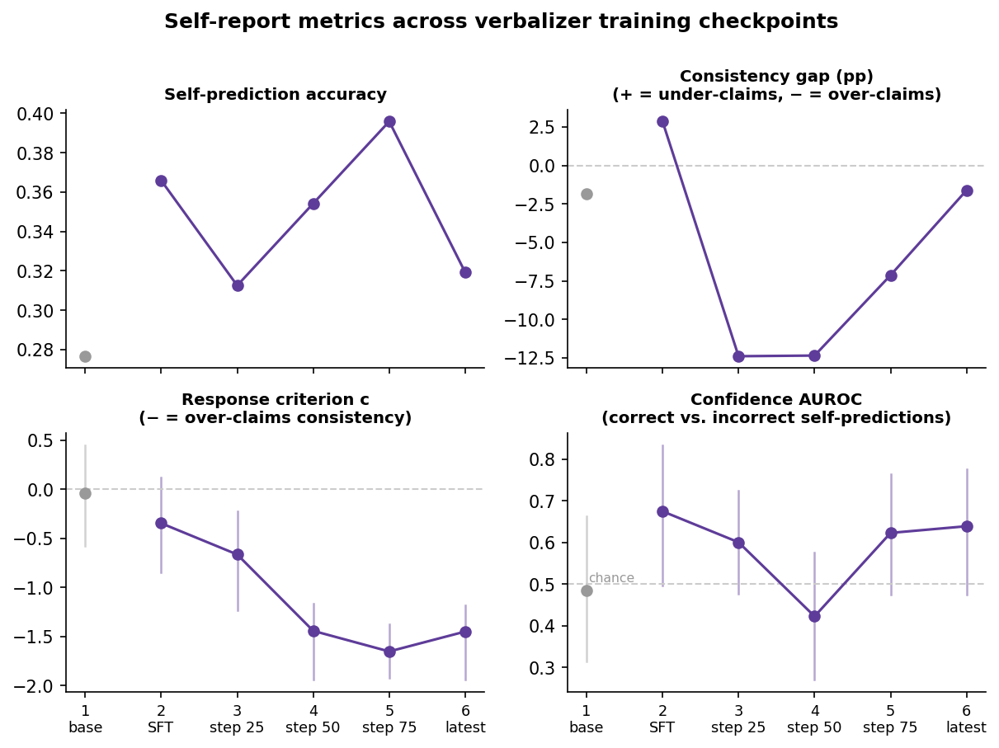
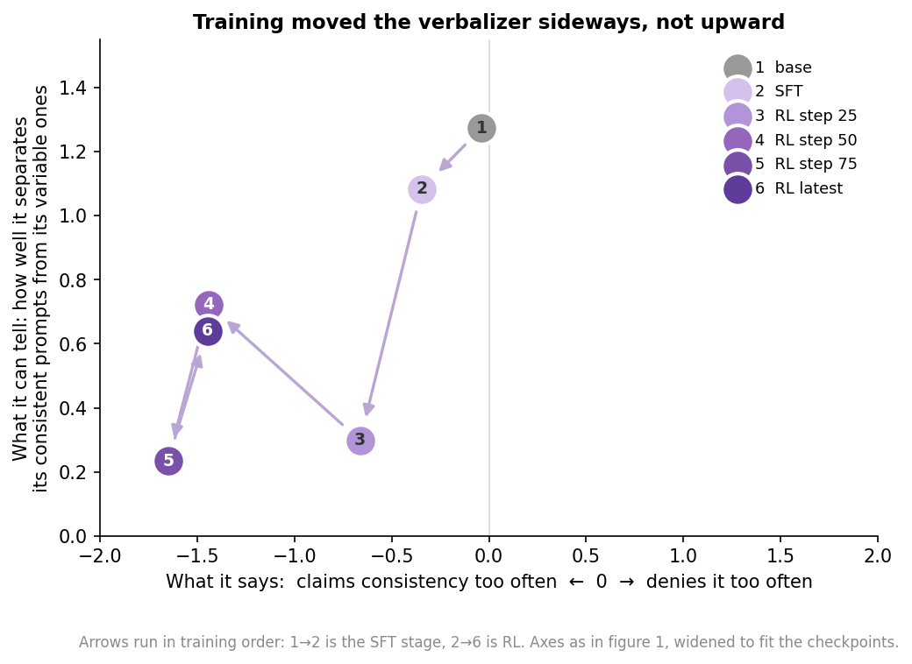

## Self-Confidence Arm: Findings

Can a model tell when its own self-knowledge is right? 
Each self-consistency claim splits into two numbers: 
- Sensitivity (d′): how well a model detects which of its own answers actually vary, and 
- Criterion (c): how readily it answers yes regardless. 
A model that cannot tell and a model that can tell but says otherwise produce the same stated-minus-actual gap, and they separate here.

Alongside that split: confidence in the model's own self-prediction, cross-prediction of the other models, and the same question asked in three wordings.

Three results carry beyond this arm:
- Yes/no self-consistency claims depend heavily on how the question is worded, and flipping the polarity reverses c for most models. 
- One bench model's perfect consistency comes from deterministic serving on its provider route, not from its weights. 
- On the r-lens checkpoints, item-level consistency stays decodable from the internal state across RL, while the verbal report's tracking of it falls off.

Intervals are 95% bootstrap CIs over items (2000 resamples). P-values are two-sided permutation or sign-flip tests.

### Key Findings

**1. Models fail at self-knowledge in two different ways, and a single gap number cannot tell them apart.** Some models cannot detect which prompts they are consistent on. Others detect it fine but report it wrong in a fixed direction. Qwen3.5 9B detects well and under-reports. Haiku 4.5 detects poorly and under-reports. Gemma 3 4B detects poorly and over-reports. Three different problems, similar gaps.

The most heavily trained verbalizer checkpoint makes the point sharpest. Its stated consistency matches its actual consistency almost exactly on average, and on the prompts where its answers genuinely vary it claims consistency nearly every time. The over-claims and under-claims cancel, so the average looks healthy where the per-prompt reporting is worst.

**2. Qwen3 8B behaved identically on every single prompt, yet said it was not consistent on 37 of 48.** Its denial is a fixed answering habit, not an observation of its own behavior. The identical behavior turned out to be the provider route serving deterministically rather than a property of the weights, but that does not rescue the self-report. The model is wrong about how it actually behaves either way.

**3. Only some models know when their self-predictions are right.** Qwen3.5 9B states confidence 90 when its self-prediction is correct and 58 when it is wrong. Gemma 3 4B and Qwen3 8B state 96 in both cases, so the number carries nothing. Haiku 4.5 is the only model whose stated confidence sits below 50, and higher versus lower still tracks right versus wrong.

**4. Models predict their own answers better than other models can, but they are no better at knowing when those predictions are right.** Four of five models beat every other model at predicting their own most common answer, by 3 to 7 points, with Qwen3 8B tying. On the confidence side the advantage disappears: for three of five models, the others judge the reliability of their guesses as well as or better than they judge themselves.

**5. RL training made the verbalizer claim consistency about nearly everything, without improving its ability to tell.** From RL step 25 to step 75 the bias toward claiming consistency grows steadily, until by step 75 it wrongly calls itself consistent on 22 of the 23 prompts where its behavior genuinely varies. Sensitivity never rises above the untrained base model. The only real improvement in confidence quality came at the SFT stage, before RL began. It learned that it is consistent, not when.

**6. That trained-in belief is a yes-habit. Ask the opposite question and you get the opposite belief.** We asked the same thing three ways, including one that flipped it around to "are your answers varied?" The RL checkpoints agree with whichever version they are handed. Most of the off-the-shelf models are unstable in the same way. Haiku 4.5 is the only one whose self-report keeps its direction no matter how the question is phrased.

**7. The model still holds internally what it stopped saying out loud.** Read the internal state directly and the signal tracking which prompts are the model's consistent ones stays steady across the whole training run, while the spoken report's tracking falls apart. RL damaged the reporting, not the underlying representation. Two things make this hard to wave away: the readout was fit on generic text and never on consistency labels, so it is not a probe trained on the answer, and the RL was rewarding the model for verbalizing this very readout.

### What Was Run

Eleven model variants: the five bench models (Haiku 4.5, Qwen3.5 9B, Qwen3 8B, Gemma 3 4B, Gemma 3n E4B) plus six checkpoints of Will's Qwen3.5-4B verbalizer, numbered throughout as:

1. base Qwen
2. SFT, trained not to refuse questions about consciousness, and the starting point for RL
3. RL step 25
4. RL step 50
5. RL step 75
6. RL latest, the live head of the still-running RL job, captured after step 75 was published

48 prompts. Ground truth for each prompt is 16 fresh samples at T=1, recording the most common answer and its share. Meta channels run at T=0: self-prediction with confidence, yes/no consistency claim with confidence, cross-prediction of the other models, and a self-foil 2AFC.

Three things are new in this revision. The consistency claim was rerun in two additional wordings, including a polarity flip, across all 12 variants. A serving-determinism check resampled five prompts eight times each at T=1.0 and again at T=1.5. And an r-lens readout sweep covered 48 items, 6 checkpoints, and 4 layer bands, with the template verified against greedy decoding first. About 11,900 original calls and 2,500 new ones, with no unresolved errors.

#### The models fail in different ways

| model | sensitivity d′ | criterion c | wording-stable? | reading |
|---|---|---|---|---|
| Qwen3.5 9B | 1.24 [0.27, 2.32] | denies (+0.72) | no, criterion flips when reworded | detects well, but its under-reporting is wording-bound |
| Haiku 4.5 | 0.47 [−0.35, 1.53] | denies (+0.68) | **yes** (+0.68, +1.07, +0.74) | detects poorly and genuinely under-reports |
| Gemma 3 4B | 0.53 [−0.52, 1.61] | claims (−0.81) | no, flips to +1.69 reworded | its over-reporting is a wording artifact |
| Gemma 3n E4B | 0.42 [−0.36, 1.36] | denies (+0.34) | no | detects poorly, criterion labile |
| Qwen3 8B | unmeasurable | n/a | n/a | route serves deterministically (finding 2) |

The d′ intervals are wide. At 48 items the *levels* of sensitivity are noisy. The robust results are the bias trend, which has tight intervals, the wording instability, and the lens dissociation.

#### Stated confidence

Qwen3.5 9B's confidence is informative: 90 when right, 58 when wrong, AUROC 0.72 [0.57, 0.85]. Gemma 3 4B and Qwen3 8B emit 96 regardless. Haiku is miscalibrated in level (45 versus 27) but directionally informative, at 0.66 with an interval that spans chance. Most models' confidence signal is individually unresolved at 48 items. The cross-model pattern, one clear success against several flat 96s, is the result.

#### Self-prediction

| predicted model | itself | best other | paired Δ vs others' mean | p |
|---|---|---|---|---|
| Qwen3.5 9B | 40% | 33% (Qwen3 8B) | +12.8 pp | 0.047 |
| Haiku 4.5 | 33% | 27% (Qwen3 8B) | +12.2 pp | 0.060 |
| Gemma 3 4B | 29% | 23% (Qwen3.5 9B) | +10.6 pp | 0.036 |
| Gemma 3n E4B | 31% | 28% (Gemma 3 4B) | +10.2 pp | 0.060 |
| Qwen3 8B | 33% | 33% (Haiku 4.5) | +11.8 pp | 0.065 |

All five paired deltas are positive, worth 10 to 13 points each, a real but modest content advantage. Each p-value is individually marginal and the agreement across all five targets is what carries it.

The advantage does not reach confidence. For three of five targets the other models' confidence separates right from wrong as well as the model's own does. Haiku judges its predictions of other models at AUROC 0.92 and its predictions of itself at 0.66 (p = 0.02), the one self-versus-cross contrast that individually resolves.

#### What RL changed

| | 1 base | 2 SFT | 3 step 25 | 4 step 50 | 5 step 75 | 6 latest |
|---|---|---|---|---|---|---|
| self-prediction accuracy | 28% | 37% | 31% | 35% | 40% | 32% |
| criterion c, original wording (− = claims consistency) | −0.04 | −0.35 | −0.66 | −1.44 | −1.65 | −1.45 |
| criterion c, polarity-flipped wording | +0.33 | +0.56 | +1.61 | +1.60 | +1.87 | +1.62 |
| wrong "consistent" claims on varying prompts | 8/30 | 13/31 | 19/27 | 21/24 | 22/23 | 23/26 |
| sensitivity d′ | 1.27 | 1.08 | 0.30 | 0.72 | 0.23 | 0.64 |
| confidence AUROC (0.5 = chance) | 0.48 | 0.67 | 0.60 | 0.42 | 0.62 | 0.64 |
| lens tracking r, for comparison | +0.42 | +0.39 | +0.34 | +0.25 | +0.33 | +0.48\* |

\* from a separate capture of the same adapter.

The two criterion rows mirror each other, which is the yes-habit. Training did not install "I am consistent." It amplified agreement with whatever yes/no self-question is posed. Meanwhile the internal signal in the bottom row is flat to rising. Whatever the RL gradient rewarded, it reshaped the verbal channel and left the state's consistency information decodable.

The verbal report's own tracking runs the other way, from +0.38 at base to +0.07 at step 75. At base the lens and the verbal report are equivalent (Δr = +0.04 [−0.33, +0.40]). At the final checkpoint the lens is ahead by Δr = +0.38 [+0.06, +0.71], the interval that carries finding 7. Confidence quality peaks at SFT and no later checkpoint clearly beats chance, though the per-checkpoint intervals are wide enough that this reading is suggestive rather than settled.

Checkpoint 6 was captured twice, at c = −1.13 in the morning and −1.45 in the evening. The drift between captures is itself evidence that the head was still moving.

Plotting the checkpoints on the same two axes as the bench models shows the shape of it. The run travels left, into claiming consistency, and never climbs.

#### Reward audit

The RL reward is the on-policy r-lens probability of the verbalized `<answer>` token on unrelated short-document episodes. No term references consistency claims, so the bias trend is not direct gaming of this bench's question.

What the reward does pay for, heavily, is compliance and assertion. There is a −1.0 format penalty for any rollout without a parseable answer, which is large against the lens reward normalized to [0,1], the same penalty for truncation, and a minimum-thinking shaping term. Sixty-plus steps of "always produce a confident, well-formatted assertion about your internals, never decline" is a sufficient mechanism for what we measure. On any yes/no self-question the model now asserts the affirmative. That is a trained assertion habit generalizing off-task. This also matches the verbalizer arm's finding that RL's clearest effect was restoring meta-task format compliance.

The follow-up is to run the hint ladder through these channels with the wording controls in place, since a hint that changes effective wording can move c without any self-knowledge being involved.

#### Caveats

- 48 prompts per cell. Most per-model AUROC and d′ *levels* have wide intervals.
- The wording-stability check covers the detect channel only. The prediction channel has not been paraphrase-tested.
- 2AFC foils fall back to hand-written alternatives when the actor distribution is unanimous. Foil plausibility then differs by class, so interpret 2AFC levels with care, not just their correlation with d′.
- The lens reads one next-token position with top-50 truncation through a fitted linear map. "Present" means linearly decodable there. The readout matched greedy decoding on 4 of 6 validation items, and the two misses were plausible near-modes.
- Gemma 3 4B ignored answer-format instructions on several prompts, so its ground truth is the noisiest.
- Cross-prediction wording names the target model, and verbalizer checkpoints are excluded from it. Checkpoint-to-checkpoint prediction needs its own wording and has not been run.
- The verbalizer's consistent classes are small, 7 to 13 prompts, so checkpoint d′ values are noisy. The bias trend is the sturdy part.

## Next steps

1. Run the hint ladder (L1 to L4) through these channels on the bench models with the wording controls in place. A generic hint should only be able to move c. If d′ moves, the measurement is contaminated. Item-specific evidence can legitimately move d′.
2. Lens follow-ups, once the r-lens server is back up: a per-layer sweep instead of bands, a read at the claim position in the detect prompt to see whether the model's state represents its consistency while it is mis-reporting it, and intervals on the per-band table.
3. A free-report variant of the consistency claim that allows PASS.

Full tables are in RESULTS.md, plots in `figures/`, raw data in `runs/`.
