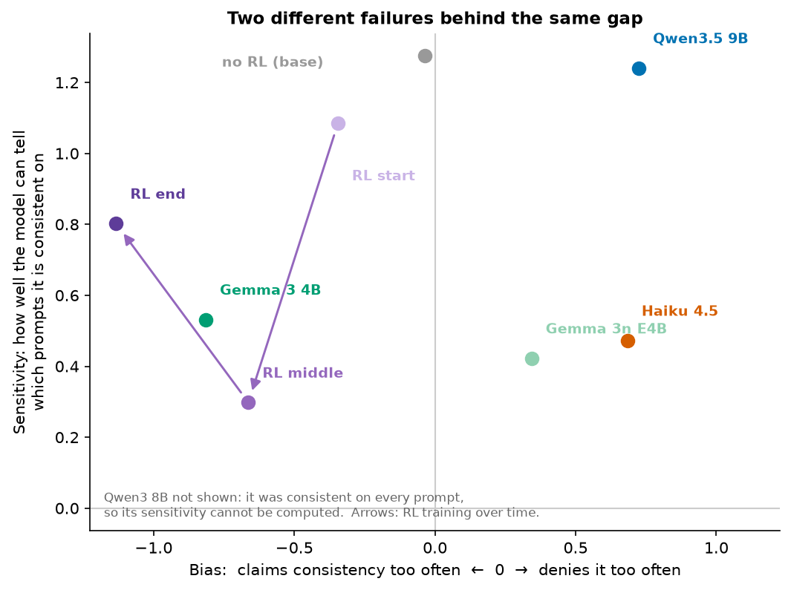
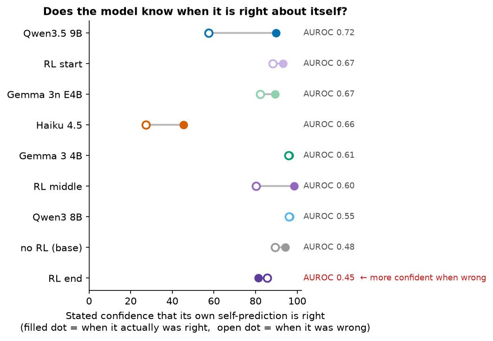
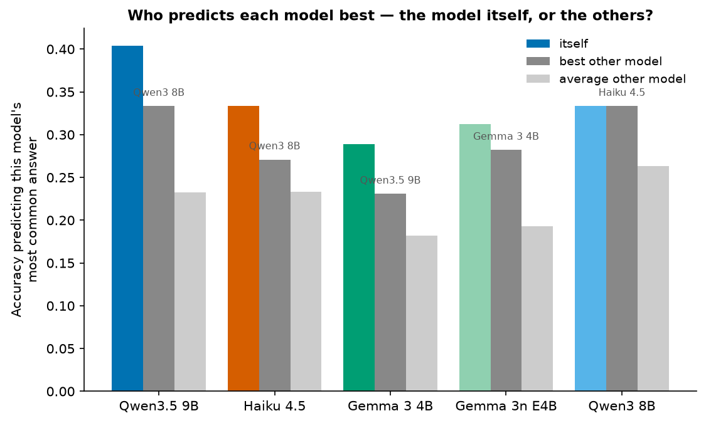
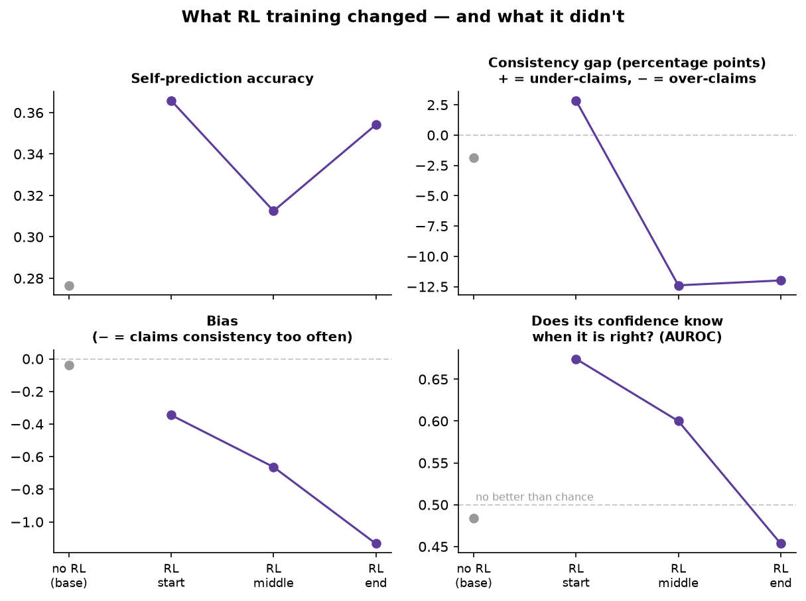
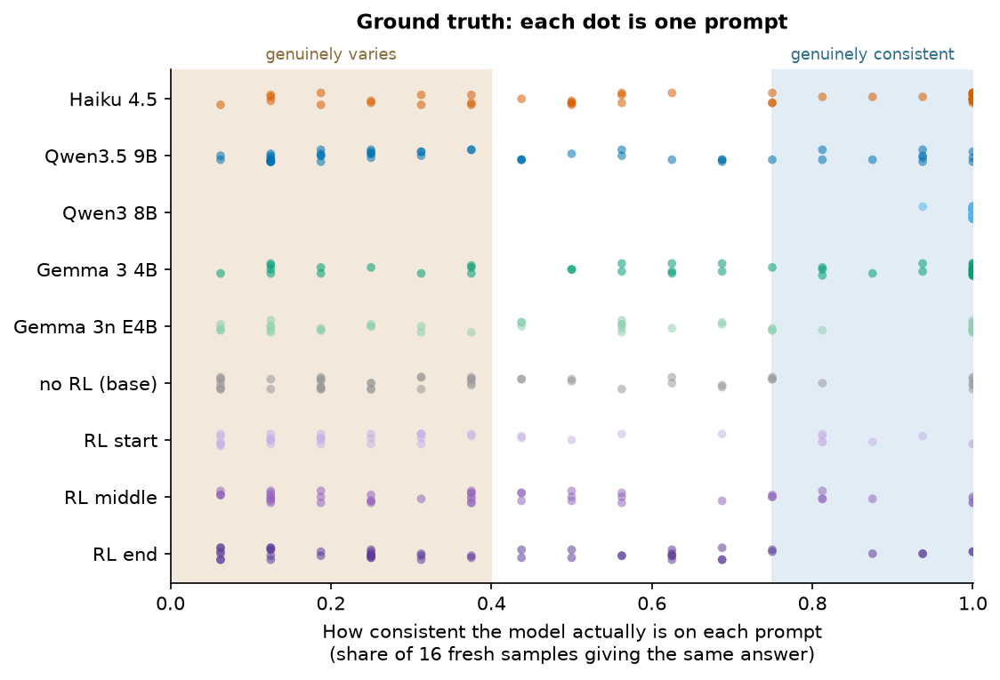

## Findings — Introspection Confidence

### Key findings

1. **Models fail at self-knowledge in two different ways, and the bench's single gap number cannot tell them apart.** Some models cannot detect which prompts they are consistent on (low sensitivity). Others can detect it but report it wrong in a fixed direction (bias). Qwen3.5 9B detects well but under-reports; Haiku 4.5 detects poorly and also under-reports; Gemma 3 4B detects poorly and over-reports.

2. **Qwen3 8B behaved identically on every single prompt yet said it was not deterministic on 37 of 48 prompts.** Its self-denial is a fixed answering habit, not an observation of its own behavior.

3. **Only some models know when their self-predictions are right.** Qwen3.5 9B states confidence 90 when its self-prediction is correct and 58 when it is wrong. Gemma 3 4B and Qwen3 8B state 96 in both cases — the confidence number carries no information. Haiku 4.5 is the only model whose stated confidence sits below 50, but higher-vs-lower still tracks right-vs-wrong.

4. **Models predict their own answers better than other models can predict them, but they are no better than other models at knowing when those predictions are right.** Four of five models beat every other model at predicting their own most common answer, by 3-7% (Qwen3 8B by zero). On the confidence side the advantage disappears: for three of five models, the other models judge the reliability of their guesses as well as or better than the model judges itself.

5. **RL training made the verbalizer claim consistency about nearly everything, without improving its ability to tell.** By the end of training it wrongly calls itself consistent on 78% of the prompts where its behavior genuinely varies, and its stated confidence is slightly higher on wrong self-predictions than on right ones. It learned *that* it is consistent, not *when*.

### Runs

Nine models: the five bench models (Haiku 4.5, Qwen3.5 9B, Qwen3 8B, Gemma 3 4B, Gemma 3n E4B) plus four checkpoints of Will's Qwen3.5-4B verbalizer (the untrained base model, and the RL run at its start, middle, and end). 

48 prompts: Each prompt was asked to each model 16 fresh times at temperature 1 to establish what the model actually does: its most common answer, and how consistent it is. Then, at temperature 0, each model was asked to predict its own most common answer with a confidence, to make a yes/no call on whether it is consistent ("would at least 75 of 100 fresh instances give the identical answer?") with a confidence, and to make the same predictions about the other models.
About 9,200 calls in total, no errors. 

Full tables: `RESULTS.md`. Plots: `figures/`. Raw data: `runs/`.

### Important Metrics

#### AUROC Metric: 
This measures whether a model's stated confidence separates its correct answers from its wrong ones: the probability that a randomly chosen correct answer received a higher confidence than a randomly chosen wrong one. 0.5 means the confidence carries no information; 1.0 means it separates perfectly; below 0.5 means
the confidence points the wrong way.

#### Sensitivity and Bias: 
The yes/no consistency call splits into:
- **Sensitivity** - can the model detect *which* prompts it is consistent on?
- **Bias** — Does the model lean toward denying or claiming consistency, regardless of the prompt? 

#### The models fail differently:

| model | sensitivity | bias | reading |
|---|---|---|---|
| Qwen3.5 9B | 1.24 | denies (+0.72) | detects well, still under-reports its consistency |
| Haiku 4.5 | 0.47 | denies (+0.68) | detects poorly and under-reports — its 49-point gap (the parent bench found 40) is both failures combined |
| Gemma 3 4B | 0.53 | claims (−0.81) | detects poorly and *over*-reports (its gap is −18 points) |
| Gemma 3n E4B | 0.42 | denies (+0.34) | detects poorly, mild under-reporting |
| Qwen3 8B | unmeasurable | — | never varies, so there is nothing to detect (see key finding 2) |

Qwen3 8B answered identically 16 out of 16 times on every prompt, so sensitivity cannot be computed — and it denied being deterministic on 37 of 48 prompts anyway. One extra detail: its confidence on those yes/no calls ranks its correct calls above its wrong ones at AUROC 0.97, so a usable signal exists inside the model even while its yes/no answer ignores it.

#### Some models know when they are right about themselves; others repeat one number

When predicting its own most common answer, each model also stated how confident it was that the named answer really is its most common one. If the model has any access to the quality of its own self-knowledge, this confidence should be higher on the predictions it got right:

- **Qwen3.5 9B**: confidence 90 when right, 58 when wrong (AUROC 0.72). The confidence
  is informative.
- **Gemma 3 4B** and **Qwen3 8B**: 96 in both cases. The number is a habit, not a report.
- **Haiku 4.5**: 45 when right, 27 when wrong — far too low in absolute terms, but the
  ordering is informative (AUROC 0.66).
- **The RL-trained verbalizer** ends below chance: more confident on its wrong
  self-predictions than on its right ones (section 4).

#### Self-knowledge covers the answer, not the reliability

The first run compared each model predicting itself against the same model predicting
others. That mixes in how hard the other models are to predict. The correct comparison
holds the *predicted* model fixed: who predicts model A best — A itself, or the other
four models? This needed no new data, only a different slice of the existing runs.

| predicted model | itself | best other model | margin |
|---|---|---|---|
| Qwen3.5 9B | 40% | 33% (Qwen3 8B) | +7 |
| Haiku 4.5 | 33% | 27% (Qwen3 8B) | +6 |
| Gemma 3 4B | 29% | 23% (Qwen3.5 9B) | +6 |
| Gemma 3n E4B | 31% | 28% (Gemma 3 4B) | +3 |
| Qwen3 8B | 33% | 33% (Haiku 4.5) | 0 |

Four of five models predict their own answers better than any other model can, by a real
but modest margin. Qwen3 8B has no advantage: Haiku predicts its answers exactly as well
as it predicts them itself.

The confidence side shows the opposite pattern. For three of the five targets, the other
models' confidence about their guesses separates right from wrong as well as or better
than the target's own confidence about itself (Gemma 3 4B: others 0.70 vs self 0.61;
Qwen3 8B: others 0.67 vs self 0.55; Gemma 3n: 0.67 both). Haiku judging its predictions
of *other* models reaches AUROC 0.92, against 0.66 for itself. So models hold private
information about **what** they will say, but not about **whether their self-model is
right**.

#### RL training changed the bias, not the sensitivity

Across the verbalizer's training run, every bias number moves and no sensitivity number
improves:

| | no RL (base) | RL start | RL middle | RL end |
|---|---|---|---|---|
| self-prediction accuracy | 28% | 37% | 31% | 35% |
| bias (− = claims consistency too often) | −0.04 | −0.35 | −0.66 | −1.13 |
| wrong "consistent" claims on genuinely varying prompts | 8 of 30 | 13 of 31 | 19 of 27 | 21 of 27 |
| sensitivity | 1.27 | 1.08 | 0.30 | 0.80 |
| confidence AUROC (0.5 = chance) | 0.48 | 0.67 | 0.60 | 0.45 |

By the end of training, the model claims consistency on 78% of the prompts where its
behavior genuinely varies; its sensitivity is no higher than before training; and its
confidence is slightly higher when its self-prediction is wrong (85) than when it is
right (81). Training installed a general belief — "I am consistent" — that the model
applies to every prompt, instead of improving its ability to check any particular prompt.

This also exposes a measurement problem in the aggregate gap statistic: the gap moves
from −2 (base) to +3 (start) to −12 (end). In the middle of that path the single number
briefly reads as perfectly calibrated — not because the model got calibrated, but because
its error was changing sign. The sensitivity/bias split does not have this failure mode.

Two follow-ups would sharpen the result: checking whether the reward directly paid the
model for claiming consistency (if so, this is exactly the gaming the measurement should
catch, and did), and checking whether the r-lens internal readout tracks actual
consistency better than the model's degraded verbal report.

#### What the second run changed

The first run had too few genuinely-varying prompts for the most consistent models (3
for Gemma 3 4B, 4 for Haiku). Twenty prompts designed for variability were added and
everything was rerun. Every model now has at least 11 prompts in each class — except
Qwen3 8B, which stayed consistent on all 48; that is a result about the model, not a
flaw in the prompt set.

Two first-run numbers changed materially once the classes were large enough, and the
old values should be discarded: Gemma 3 4B's sensitivity (was 1.29, now 0.53 — the high
value came from a 3-prompt class) and Haiku's (was 0.03, now 0.47 — Haiku does have some
ability to detect which prompts it is consistent on, underneath its bias toward denial).

#### Caveats

- 48 prompts per cell; each confidence is a single temperature-0 statement. Robustness
  to rewording (listed in METHOD.md's optional checks) has not been run.
- Qwen3 8B's perfect consistency could reflect the provider serving effectively greedy
  decoding rather than true sampling; the parent bench saw the same behavior. Worth one
  direct check before relying on this result.
- Gemma 3 4B ignored the answer-format instruction on several prompts, giving verbose
  answers that fragment its distribution; its ground truth is the noisiest.
- Cross-prediction wording names the target model, and the four verbalizer checkpoints
  are excluded from it (same underlying model, so the wording would be false).
  Checkpoint-to-checkpoint prediction needs its own wording and has not been run.

#### Next steps

1. Hint ladder (levels 1–4) through these same prompts — the pre-registered
   bias-versus-sensitivity predictions in METHOD.md.
2. The r-lens internal readout for the four checkpoints: is consistency information
   present internally but missing from the verbal report?
3. Checkpoint-to-checkpoint cross-prediction with adapted wording (does the trained
   model still know what the base model would say?).
